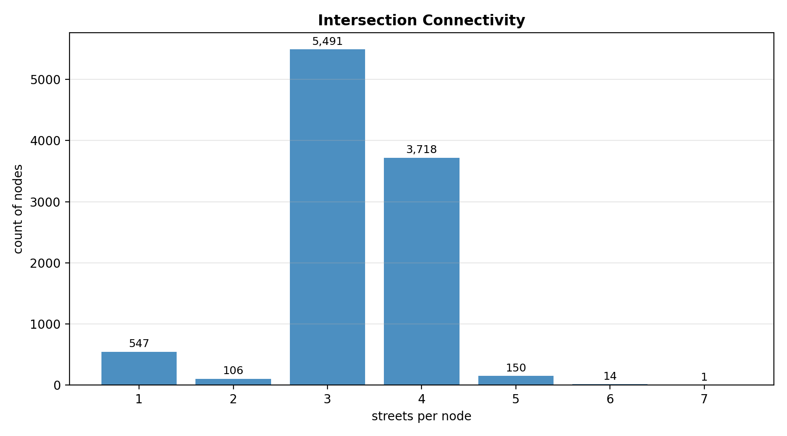
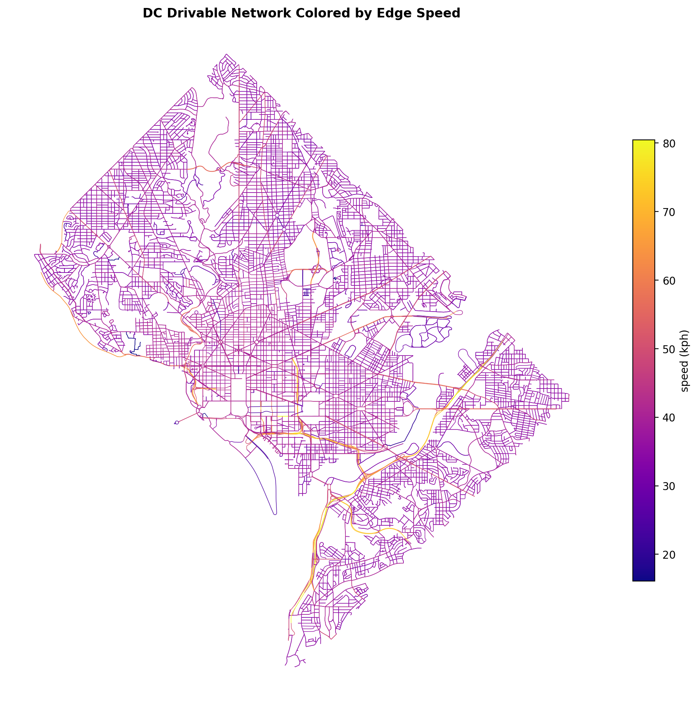
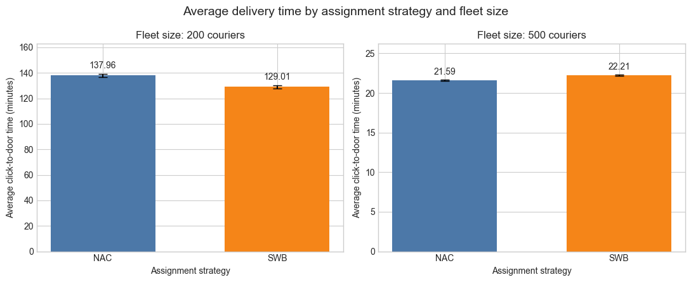
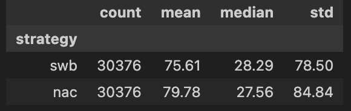
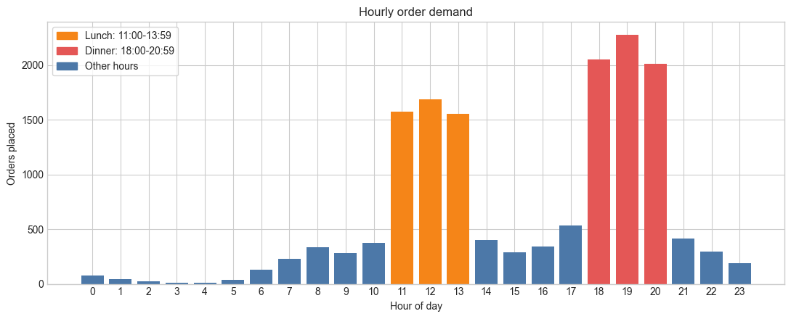
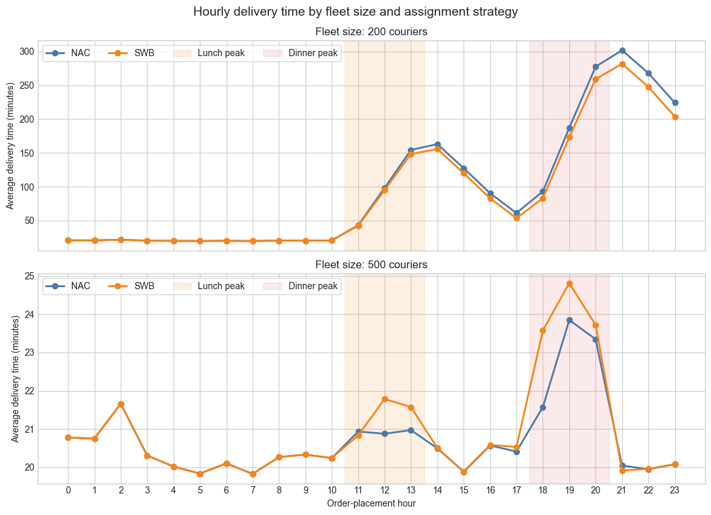

# Introduction 

Nowadays, food delivery has become common in most cities. However, customers usually only see the final delivery time. The process behind each order is much more complex. The platform needs to assign a courier, select a route, and deliver the order under changing traffic and demand conditions.

Previous studies mainly focus on courier assignment and route optimization. However, they pay less attention to how the road network itself affects delivery performance. Even with a good assignment strategy, important roads or intersections may still become bottlenecks. Road closures and high demand can also cause longer delivery times. Based on this, our project studies both the road network and courier assignment strategies.

To start the analysis, we use the Washington, DC road network from OpenStreetMap. We also use restaurant locations, population data, 2024 traffic counts, and a simulated day containing 15,188 orders. Also, the population density is used to represent customer demand. The simulated orders include lunch and dinner peaks, which allows us to test the delivery system under different demand levels.

Our analysis contains two main parts. First, we examine the structure of the road network. By applying bottleneck detection, estimating the demand ceiling, testing renovation targets, and measuring the clustering effect, we came up with 4 structural questions:

1. *RQ1.* Do simple metrics find the choke points, or is a more robust method needed?
2. *RQ2.* Is there a volume the network simply can't move fast enough to meet?
3. *RQ3.* Which roads give the most improvement if upgraded?
4. *RQ4.* Do restaurant clusters help or hurt delivery?

Then, we examine delivery operations by comparing two courier assignment strategies. We also test their performance during peak hours, under road closures, and with different fleet sizes, and then came up with 4 operational questions:

5. *RQ5.* Which assignment method gives the fastest average delivery time?
6. *RQ6.* How does performance shift during lunch and dinner rushes?
7. *RQ7.* How much worse is a targeted road closure than a random one, and does strategy matter?
8. *RQ8.* What's the ideal number of couriers for the network?

To sum up, this project studies how road structure and courier assignment work together in an urban food delivery system. Based on the results, we can better understand what causes delivery delays, which roads are the most important, and how many couriers are needed for reliable delivery performance.

# Data

The drivable street network for Washington, DC was downloaded from OpenStreetMap with OSMnx. Cleaning kept the largest strongly connected component, which leaves 10,027 intersections and 26,938 directed edges (1,928 km of streets) and means every location can reach every other along legal driving directions. Only about a third of edges have an explicit speed tag, so missing speeds were filled in with the mean tagged speed of the same road type, and every edge got a free flow travel time weight. These free flow times ignore congestion, which is a limitation that carries into every result below.

Restaurant POIs come from OpenStreetMap amenity tags for restaurants, fast food, and cafes, which gives 2,043 locations after removing same name duplicates within 50 m. Each POI was snapped to the network with a median snap distance of 19.4 m. As an outside check on coverage, 98.3 percent of the 877 active ABCA restaurant liquor licenses fall within 100 m of an OSM POI, so the POI layer does not seem to be missing much of the sit down market. Observed 2024 traffic counts (AADT) from DDOT attach to 6,109 edges (22.7 percent), which are the main roads the city actually monitors. Census tract population (206 tracts, 672,079 residents) joins to every network node and serves as the demand proxy, since no public delivery logs exist for DC.

Demand itself is simulated on top of this data. A synthetic day of 15,188 orders arrives as a nonhomogeneous Poisson process with lunch and dinner peak multipliers of 3.5 and 4.5. This puts 31.7 percent of orders in the lunch window and 41.8 percent in the dinner window, with a peak hour of 2,279 orders at 19:00. Pickups are drawn uniformly from the restaurant POIs and dropoff probabilities are proportional to node level population density, following the setup in @reyes2018. Each order also carries its unassisted shortest path drive time, with a mean of 8.26 minutes, which is the floor that no assignment policy can beat.

# Exploratory Data Analysis

The cleaned network behaves like the planned grid that it is. Intersections average 3.29 streets per node and an average degree of 5.37, total street length is 1,928 km, and self loops are very rare, so the graph looks like a proper street network rather than a set of odd geometries.

{#fig-streetcounts width=60%}

As we can see from the plot above, most intersections connect three or four streets and dead ends are fairly rare, which reflects the L'Enfant grid. This is a helpful layout for routing, because a courier blocked on one segment usually has a parallel street right next to it. The structural analysis asks where that backup runs out.

{#fig-speeds width=60%}

As we can see from the plot above, the speed structure follows the road hierarchy we would expect. The interstate segments in the southeast and the parkway corridors along the rivers carry the highest speeds, the diagonal avenues sit in the middle, and the large residential fabric fills in around 35 kph. Deliveries are won or lost on how quickly couriers can move between these slow local streets and the faster main roads.

{#fig-poidist width=95%}

As we can see from the plot above, the restaurant supply is far from uniform. Full service restaurants dominate the count, and the density panel shows sharp concentrations downtown and along the 14th Street, U Street, H Street, and Georgetown corridors. Large areas east of the Anacostia River and in the residential northeast have only scattered supply.

{#fig-demand width=95%}

As we can see from the plot above, the supply and the demand proxy do not live in the same places. The ten most restaurant dense tracts hold 37.2 percent of all restaurants but only 4.1 percent of the population, and the tract level correlation between population and restaurant count is basically zero at -0.09. Delivery in DC is therefore a transport problem at its core, because the food is made downtown and in the northwest corridors while much of the demand lives elsewhere.

{#fig-reach width=60%}

As we can see from the plot above, free flow reach from the 14th Street core is generous. About 23 percent of intersections are reachable within five minutes, 68 percent within ten, and nearly the whole District within fifteen. The catch is that these are free flow times built from imputed speeds, so real congestion and service overheads will shrink this picture. The gradient also runs against the demand map, since the areas beyond the ten minute band are exactly the population dense areas east of the river.

# Methodology

## RQ1: Bottleneck Detection

The bottleneck question asks whether simple metrics find the choke points or whether a more robust method is needed. We compute travel time weighted edge betweenness centrality, approximated over 150 sampled sources, which estimates the share of shortest paths that cross each edge. @joshi2022 use the same idea when they precompute shortest path structure for assignment in dynamic road networks. We then compare the betweenness ranking against observed AADT and against edge speed, the two simple options someone would try first, using Spearman rank correlation and the overlap between the top one percent sets.

## RQ2: Demand Ceiling

The demand ceiling question asks whether there is an order volume the network simply cannot move fast enough to meet. We answer it with throughput arithmetic on the simulation setup. The mean busy cycle per delivery, measured in uncongested reference runs, converts into how many orders one courier can complete per hour. Comparing that capacity against the arrival profile of the synthetic day shows the rate at which a given fleet gets overwhelmed.

## RQ3: Renovation Targets

The renovation question asks which roads give the most improvement if upgraded. We run a simple counterfactual on a common origin destination sample of 320 restaurant to demand pairs. The highest betweenness surface edges with speeds below 40 kph, seven edges under the current threshold, are raised to a 48 kph arterial standard, travel times are recomputed, and the change in mean OD travel time is measured. Three upgrades of the same number of random slow edges serve as the control.

## RQ4: Restaurant Clustering

The clustering question has two halves. The first asks whether DC restaurants cluster more than chance would produce, which we measure with nearest neighbor distances against a uniform random baseline inside the DC boundary, summarized with the Clark-Evans ratio. The second asks whether being inside a cluster helps or hurts access to demand. We compare restaurants with at least ten neighbors within 250 m against effectively isolated restaurants, measuring mean network travel time from each group to the same population weighted demand sample.

## RQ5: Best Strategy

To address which courier assignment strategy gives the fastest average delivery time, we compared the Nearest Available Courier (NAC) and Shortest Workload-Based (SWB) strategies. The main measurement was click-to-door time. It measures the total number of minutes from when an order is placed until it is delivered.

The delivery-event dataset contains 60,752 rows. Each strategy and fleet-size setting contains the same 15,188 orders. Since delivery time is strongly affected by the number of available couriers, we compared the strategies separately for fleets of 200 and 500 couriers.

For each setting, we calculated the mean, median, standard deviation, and 95% confidence interval of the delivery time. We also applied a paired t-test, since the same orders were tested under both strategies. Therefore, these methods allowed us to determine whether the difference between NAC and SWB was statistically significant.

## RQ6: Peak Load

To address how deliveries change during high-demand periods, we used the simulated order data and delivery-event data. The order data contains 15,188 orders; we applied this data to identify changes in hourly demand. The delivery-event data contains 60,752 rows and was used to measure delivery performance.

First, we counted the number of orders placed during each hour. Then, we defined lunch as 11:00 AM to 1:59 PM and dinner as 6:00 PM to 8:59 PM. Based on the hourly results, the overnight and morning period from 12:00 AM to 10:59 AM was used as the low-demand baseline.

Then, we calculated the average, median, and 95th percentile delivery time for each period. We also measured the percentage of orders delivered within 45 minutes. Since fleet size and assignment strategy may affect the results, we compared the Nearest Available Courier (NAC) and Shortest Workload-Based (SWB) strategies separately for fleets of 200 and 500 couriers.

Moreover, we separated the total delivery time into pre-pickup time and pickup-to-door time. This allowed us to determine whether the delays came from orders waiting for a courier or from the final trip to the customer. We also examined the hours after each demand peak to see whether the order backlog continued after demand decreased.

## RQ7: Robustness

## RQ8: Fleet Size

# Results

## RQ1: Bottleneck Detection

{#fig-aadt width=85%}

As we can see from the plot above, observed traffic volume concentrates on the freeway spine, the river bridges, and a small set of surface arterials. Volume alone, however, is not structure. The Spearman rank correlation between betweenness and observed AADT is 0.42 on monitored edges, and 0.58 between betweenness and free flow speed, but the top one percent of edges by AADT and by betweenness overlap by just 8 percent.

{#fig-bottlenecks width=85%}

As we can see from the plot above, the betweenness ranking concentrates on a short list of crossings led by the 3rd Street Tunnel and the Southeast Freeway, with Florida Avenue the leading surface street. These are the true chokepoints in the sense that shortest paths have no good way around them. The answer to RQ1 is that simple metrics are useful backup evidence but would miss most of the chokepoints, so the path based measure is needed.

## RQ2: Demand Ceiling

An uncongested courier completes about 2.9 orders per hour given the 20.5 minute busy cycle, so holding the 2,279 order 19:00 peak without a growing queue would take roughly 780 couriers. A 500 courier fleet, the size that meets the daily service standard in the operational analysis, caps out near 1,461 orders per hour. It survives the rush only because the peak is short enough for the backlog to drain afterward. Daily volume is not the problem, since that same fleet could move about 35,000 orders in a flat day. The answer to RQ2 is that the ceiling is a limit on orders per hour rather than on total daily orders, near 1,500 per hour at fleet 500, and it binds at dinner.

## RQ3: Renovation Targets

{#fig-renovation width=70%}

As we can see from the plot above, the targeted upgrade lands on Florida Avenue NW and New Jersey Avenue NW and improves mean travel time by about 0.09 percent, while an equal sized random upgrade does basically nothing. Targeting by betweenness works, but no handful of edge fixes meaningfully changes citywide delivery times, because the slow part of a delivery is the residential last leg rather than any single arterial segment. Renovation budgets should follow the betweenness ranking with expectations set at corridor scale.

## RQ4: Restaurant Clustering

{#fig-clustering width=85%}

As we can see from the plot above, the observed nearest neighbor distances sit far to the left of the random baseline. The mean observed spacing is 47 m against an expected 147 m under complete spatial randomness, a Clark-Evans ratio of 0.32, which matches the clustering behavior found in Milan by @leonardi2023. On the access half, restaurants inside clusters reach the common demand sample in 8.29 minutes on average against 9.88 minutes for isolated restaurants, an advantage of about 16 percent. Clusters sit where the street network is fastest to everywhere else, so on static accessibility clustering helps delivery rather than hurting it. What this comparison cannot capture is congestion inside clusters at peak and the batching effects that @liang2024 show matter most during rushes, so we treat the operational half of RQ4 as open for the assignment analysis.

## RQ5: Best Strategy

{#fig-strategy width=85%}

As we can see from the plot above, the results shows the average delivery time for NAC and SWB under both fleet sizes. With 200 couriers, SWB had an average delivery time of 129.01 minutes, while NAC had an average of 137.96 minutes. Therefore, SWB was 8.95 minutes faster, which is a 6.49% reduction in delivery time. However, the result changed when 500 couriers were available. NAC had an average delivery time of 21.59 minutes, while SWB had an average of 22.21 minutes. In this setting, NAC was about 0.62 minutes faster. The paired t-test showed a p-value less than 0.001, which means that the differences were statistically significant for both fleet sizes.

{#fig-clustering width=85%}

Moreover, as we can see from the table above, when both fleet sizes were combined, SWB had the fastest overall average delivery time. Its average was 75.61 minutes, compared with 79.78 minutes for NAC. Based on these results, we see that the best strategy depends on fleet size. SWB works better when the number of couriers is limited, while NAC is slightly faster when 500 couriers are available.

## RQ6: Peak Load

{#fig-hourly-demand width=85%}

As we can see from the above, @fig-hourly-demand shows two clear high-demand periods during the simulated day. Lunch contains 4,810 orders and averages 1,603 orders per hour. Dinner contains 6,341 orders and averages 2,114 orders per hour. Together, these periods contain 73.42% of all orders, even though they only cover six hours. Dinner demand is about 31.84% higher than lunch demand.

{#fig-hourly-delivery width=85%}

Also, as we can see from the above, @fig-hourly-delivery shows how the change in demand affects delivery time under each fleet size and assignment strategy. We see that the fleet of 200 couriers cannot clear orders as quickly as they arrive. Delivery time begins to increase during lunch and continues after the lunch peak ends. It increases again during dinner and reaches its highest level after the dinner peak.

However, the fleet of 500 couriers remains close to its normal performance. Delivery time increases slightly during lunch and dinner, but it returns to around 20 minutes after each peak.

@tbl-period-delivery shows the exact average delivery time for each setting.

| Fleet size | Strategy | Baseline (min) | Lunch (min) | Dinner (min) | Late evening (min) |
|------------:|:--------:|---------------:|------------:|-------------:|-------------------:|
| 200         | NAC      | 20.36          | 98.39       | 185.33       | 274.21             |
| 200         | SWB      | 20.36          | 95.02       | 171.22       | 253.94             |
| 500         | NAC      | 20.24          | 20.93       | 22.95        | 20.02              |
| 500         | SWB      | 20.24          | 21.41       | 24.06        | 19.97              |

: Average click-to-door delivery time by period. {#tbl-period-delivery}

With 200 couriers, average delivery time increases from about 20 minutes to 95–98 minutes at lunch and 171–185 minutes at dinner. SWB performs better, but the backlog continues after dinner. With 500 couriers, delivery time stays between 21 and 24 minutes. Since pickup-to-door time remains near 10 minutes, most delays occur before pickup. Therefore, high demand mainly causes delays when there are not enough couriers.

## RQ7: Robustness

## RQ8: Fleet Size

# Conclusion