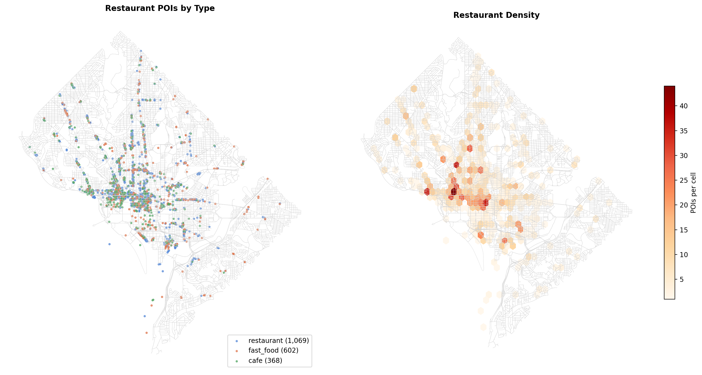
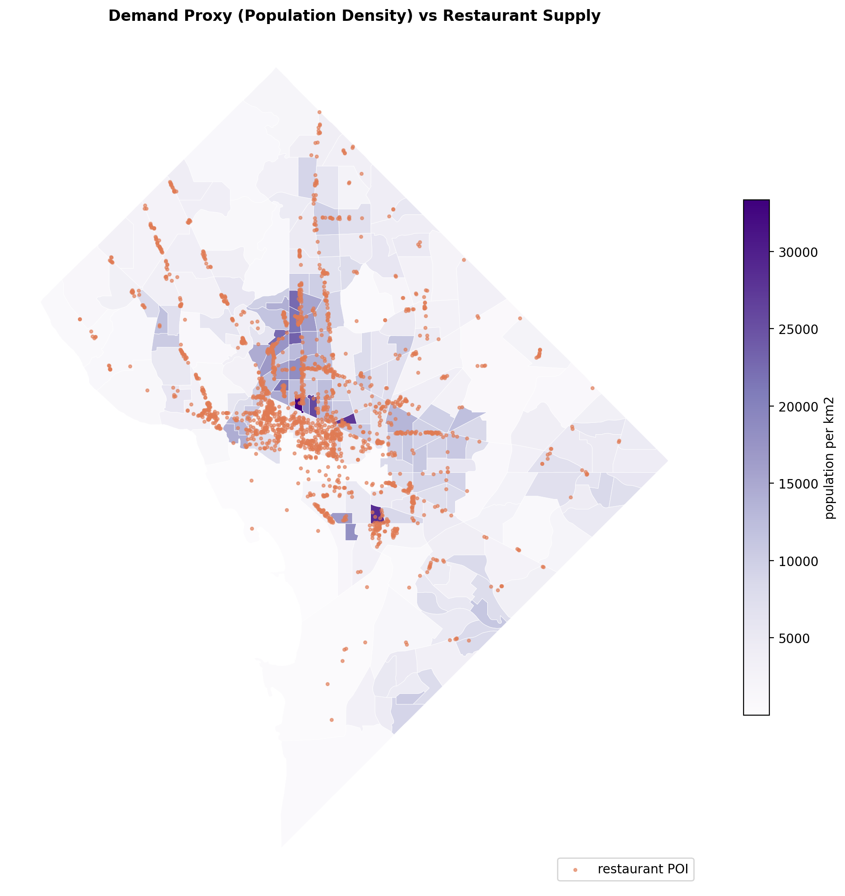
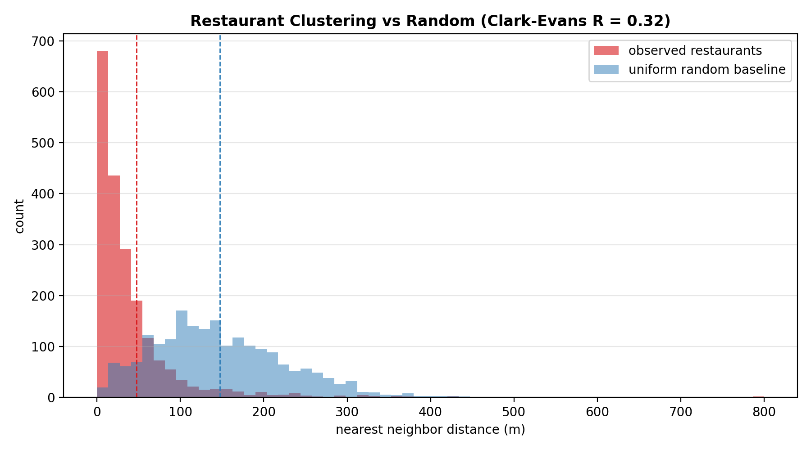

# Introduction

<!-- section content: Tianyu -->

# Literature Review

<!-- section content: Tianyu -->

# Data

The drivable street network for the District of Columbia was ingested from OpenStreetMap with OSMnx. Cleaning kept the largest strongly connected component, which preserves 10,027 intersections and 26,938 directed edges (1,928 km of streets) and guarantees that every location can legally reach every other. About a third of edges carry an explicit speed tag, so missing speeds were imputed from the mean tagged speed of the same highway type and every edge received a free flow travel time weight. These free flow times are a lower bound that ignores congestion, a limitation that carries into every result below.

Restaurant POIs come from OpenStreetMap amenity tags for restaurants, fast food, and cafes, 2,043 locations after removing same name duplicates within 50 m. Each POI was snapped to the network with a median snap distance of 19.4 m. As an external check on coverage, 98.3 percent of the 877 active ABCA restaurant class liquor licenses fall within 100 m of an OSM POI, which suggests the POI layer is not missing much of the sit down market. Observed 2024 average annual daily traffic from DDOT attaches to 6,109 edges (22.7 percent), the arterial skeleton the city actually monitors. Census tract population (206 tracts, 672,079 residents) joins to every network node and serves as the demand proxy, since no public delivery logs exist for DC.

Demand itself is simulated on this substrate. A synthetic day of 15,188 orders arrives as a nonhomogeneous Poisson process with lunch and dinner peak multipliers of 3.5 and 4.5, producing 31.7 percent of orders in the lunch window and 41.8 percent in the dinner window with a peak hour of 2,279 orders at 19:00. Pickups draw uniformly from the restaurant POIs and dropoff probabilities are proportional to node level population density, following the ready time and demand treatment in @reyes2018. Each order carries its unassisted shortest path drive time, with mean 8.26 minutes, which is the floor no assignment policy can beat.

# Exploratory Data Analysis

The cleaned network behaves like the planned grid it is. Intersections average 3.29 streets per node and an average degree of 5.37, most nodes connect three or four streets, and dead ends are comparatively rare. From a routing point of view this is a forgiving topology, because a courier blocked on one segment usually has an immediate parallel alternative, and the question the structural analysis takes up is where that redundancy runs out.

{#fig-poidist width=95%}

As we can see from the plot above, the restaurant supply is anything but uniform. Full service restaurants dominate the count, and the density panel shows sharp concentrations downtown and along the 14th Street, U Street, H Street, and Georgetown corridors. Large areas east of the Anacostia River and in the residential northeast carry only scattered supply.

{#fig-demand width=85%}

As we can see from the plot above, the supply and the demand proxy do not live in the same places. The ten most restaurant dense tracts hold 37.2 percent of all restaurants but only 4.1 percent of the population, and the tract level correlation between population and restaurant count is effectively zero at -0.09. Delivery in DC is therefore structurally a transport problem, because the food is made downtown and in the northwest corridors while much of the demand sleeps elsewhere.

{#fig-reach width=85%}

As we can see from the plot above, free flow reach from the 14th Street core is generous. About 23 percent of intersections are reachable within five minutes, 68 percent within ten, and effectively the whole District within fifteen. The catch is that these are free flow times built from imputed speeds, so peak congestion and service overheads will compress this picture, and the gradient runs against the demand map since the areas beyond the ten minute band are exactly the population dense areas east of the river.

# RQ1: Bottleneck Detection

## Methodology

The bottleneck question asks whether simple metrics find the choke points or whether a more robust method is needed. We compute travel time weighted edge betweenness centrality, approximated over 150 sampled sources, which estimates the share of shortest paths that cross each edge. @joshi2022 rely on the same intuition when they precompute shortest path structure for assignment in dynamic road networks. The betweenness ranking is then compared against observed AADT load and against edge speed, the two simple alternatives a practitioner might reach for first, using Spearman rank correlation and the overlap between top one percent sets.

## Results

{#fig-aadt width=85%}

As we can see from the plot above, observed traffic volume concentrates on the freeway spine, the river bridges, and a small set of surface arterials. Volume alone, however, is not structure. The Spearman rank correlation between betweenness and observed AADT is 0.42 on monitored edges, and 0.58 between betweenness and free flow speed, yet the top one percent of edges by AADT and by betweenness overlap by just 8 percent.

{#fig-bottlenecks width=85%}

As we can see from the plot above, the betweenness ranking concentrates on a short list of crossings led by the 3rd Street Tunnel and the Southeast Freeway, with Florida Avenue the leading surface street. These are the true chokepoints in the sense that shortest paths have no good way around them. The answer to RQ1 is that simple metrics are useful corroboration but would miss most of the structural chokepoints, so the path based measure is needed.

# RQ2: Demand Ceiling

## Methodology

The demand ceiling question asks whether there is an order volume the network simply cannot move fast enough to meet. We answer it with throughput arithmetic on the simulation substrate. The mean busy cycle per delivery, measured in uncongested reference runs, converts into a sustainable per courier hourly throughput, and comparing that capacity against the observed arrival profile of the synthetic day locates the rate at which a given fleet saturates.

## Results

An uncongested courier completes about 2.9 orders per hour given the 20.5 minute busy cycle, so holding the 2,279 order 19:00 peak without queue growth would require roughly 780 couriers. A 500 courier fleet, the size that meets the daily service standard in the operational analysis below, caps out near 1,461 orders per hour and survives the rush only because the peak is brief enough for its transient backlog to drain afterward. Daily volume is comfortably within capacity, since that same fleet could move about 35,000 orders in a flat day against the 15,188 simulated. The answer to RQ2 is that the ceiling is an instantaneous rate constraint rather than a volume constraint, near 1,500 orders per hour at fleet 500, and it binds at dinner.

# RQ3: Renovation Targets

## Methodology

The renovation question asks which roads give the most improvement if upgraded. We run a simple counterfactual on a common origin destination sample of 320 restaurant to demand pairs. The highest betweenness surface edges with speeds below 40 kph, seven edges under the current threshold, are raised to a 48 kph arterial standard, travel times are recomputed, and the change in mean OD travel time is measured. Three upgrades of equally many random slow edges serve as the control.

## Results

{#fig-renovation width=70%}

As we can see from the plot above, the targeted upgrade lands on Florida Avenue NW and New Jersey Avenue NW and improves mean origin destination travel time by about 0.09 percent, while an equal sized random upgrade is indistinguishable from zero. Targeting by betweenness therefore works, but no handful of edge fixes meaningfully changes citywide delivery times, because the slow portion of a delivery is the residential last leg rather than any single arterial segment. Renovation budgets should follow the betweenness ranking with expectations set at corridor scale.

# RQ4: Restaurant Clustering

## Methodology

The clustering question has two halves. The first asks whether DC restaurants cluster more than chance would produce, which we measure with nearest neighbor distances against a uniform random baseline inside the DC boundary and summarize with the Clark-Evans ratio. The second asks whether locating inside a cluster helps or hurts access to demand. We compare restaurants with at least ten neighbors within 250 m against effectively isolated restaurants, measuring mean network travel time from each group to the same population weighted demand sample.

## Results

{#fig-clustering width=85%}

As we can see from the plot above, the observed nearest neighbor distances sit far to the left of the uniform baseline. The mean observed spacing is 47 m against an expected 147 m under complete spatial randomness, a Clark-Evans ratio of 0.32, consistent with the deliberate agglomeration documented in Milan by @leonardi2023. On the access half, restaurants inside clusters reach the common demand sample in 8.29 minutes on average against 9.88 minutes for isolated restaurants, an advantage of about 16 percent. Clusters sit where the street network is fastest to everywhere else, so on static accessibility clustering helps delivery rather than hurting it. What this comparison cannot capture is peak congestion inside clusters and the batching economics that @liang2024 show matter most during rushes, so we treat the operational half of RQ4 as open for the assignment analysis below.

# RQ5: Assignment Strategy

<!-- section content: Tianyu -->

# RQ6: Peak Load

<!-- section content: Tianyu -->

# RQ7: Robustness to Road Closures

<!-- section content: Tianyu -->

# RQ8: Fleet Size

<!-- section content: Tianyu -->

# Conclusion

<!-- section content: Tianyu -->
