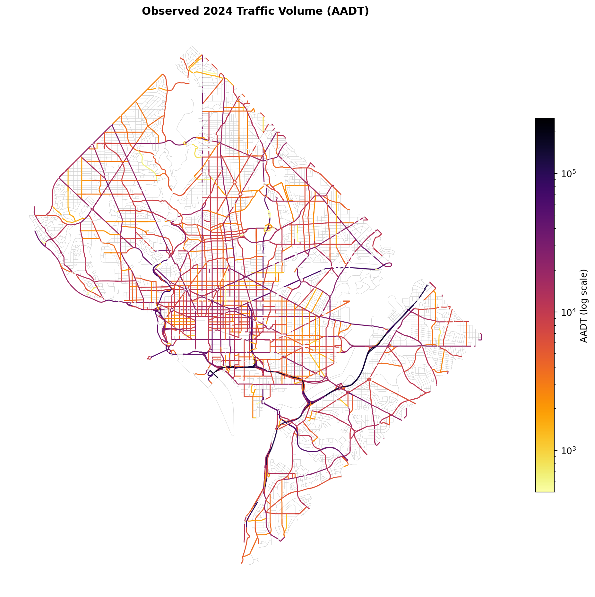
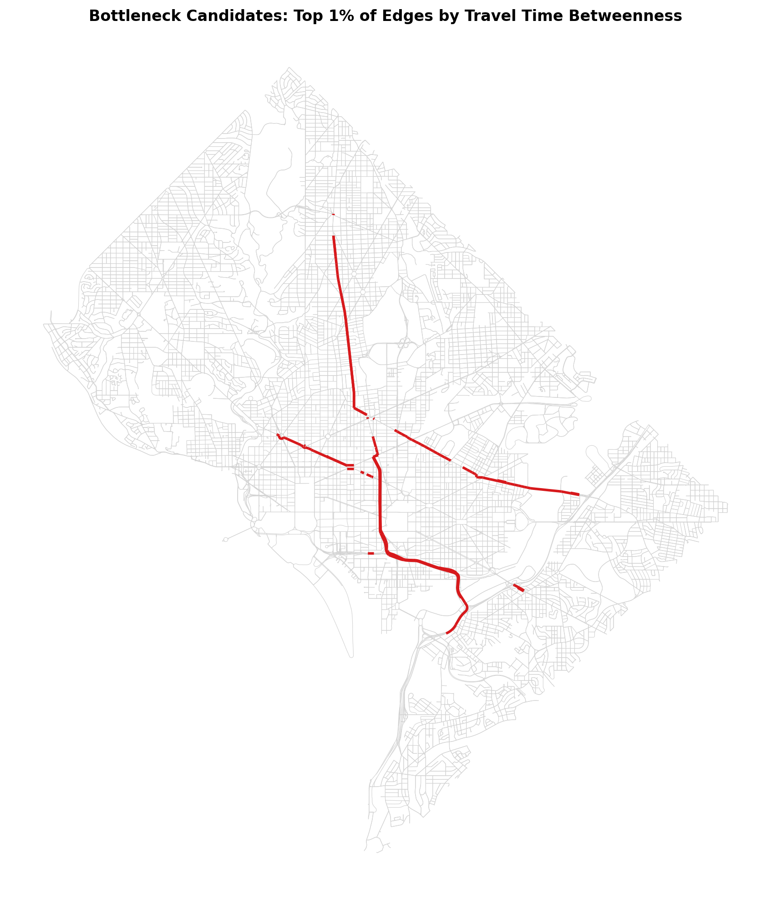
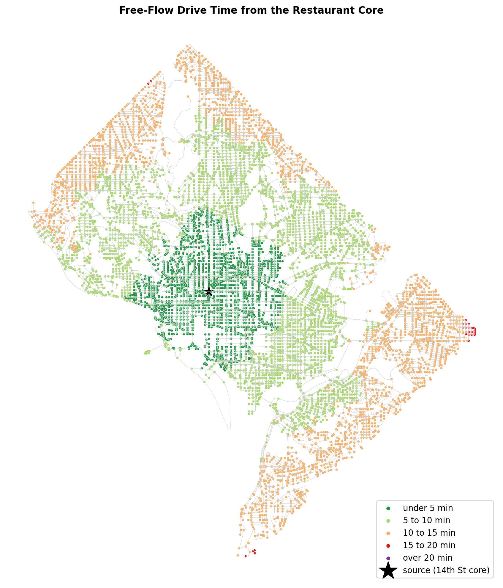
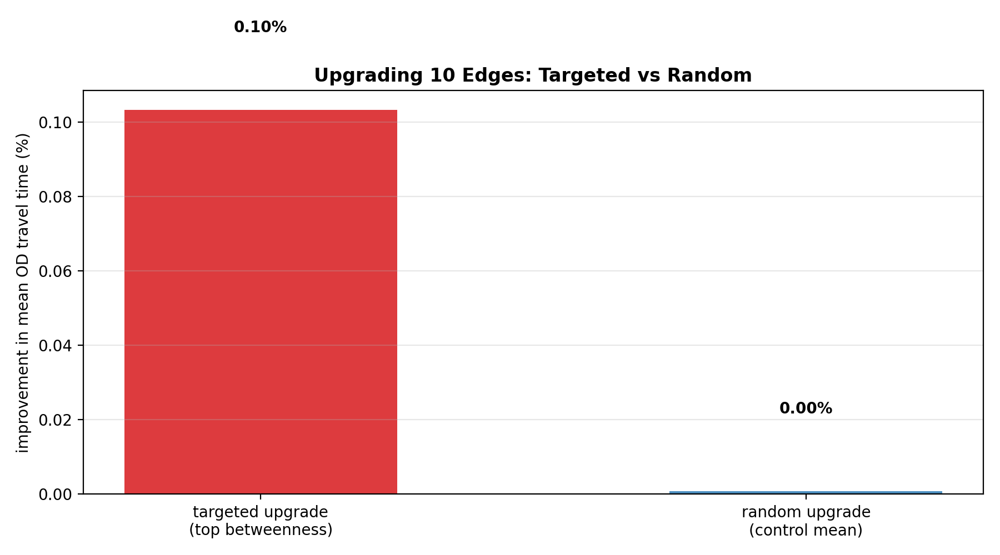
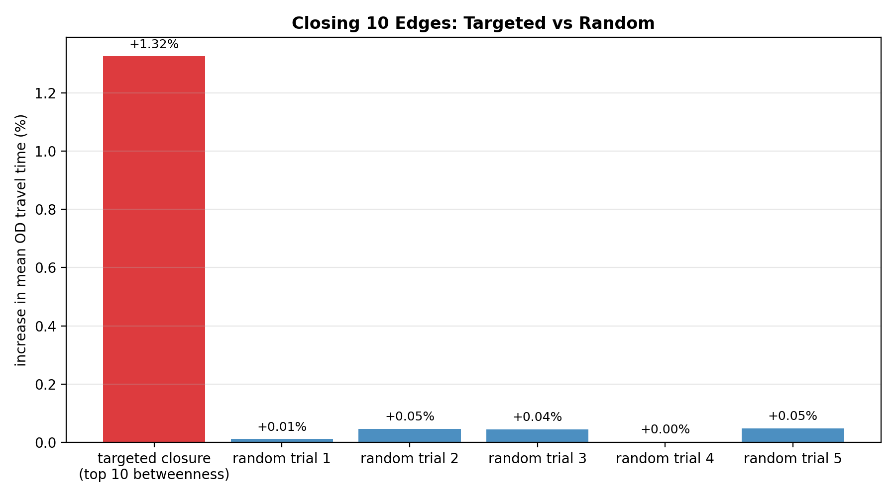
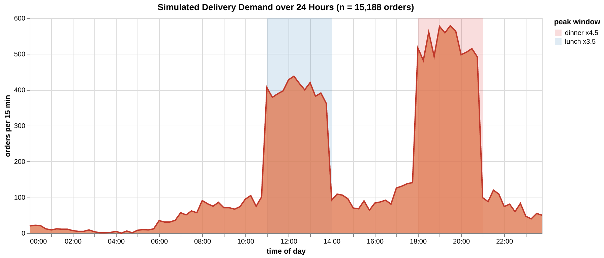
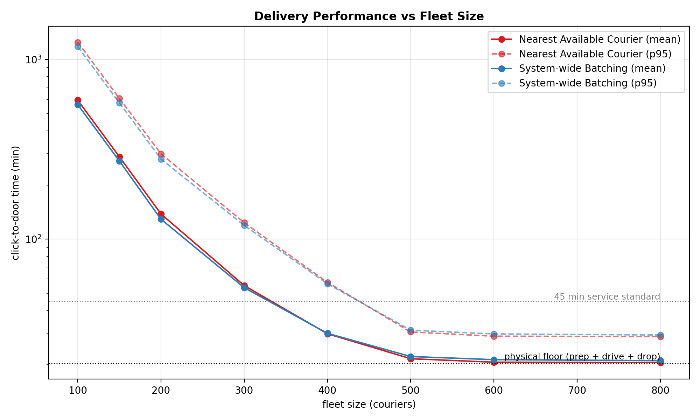
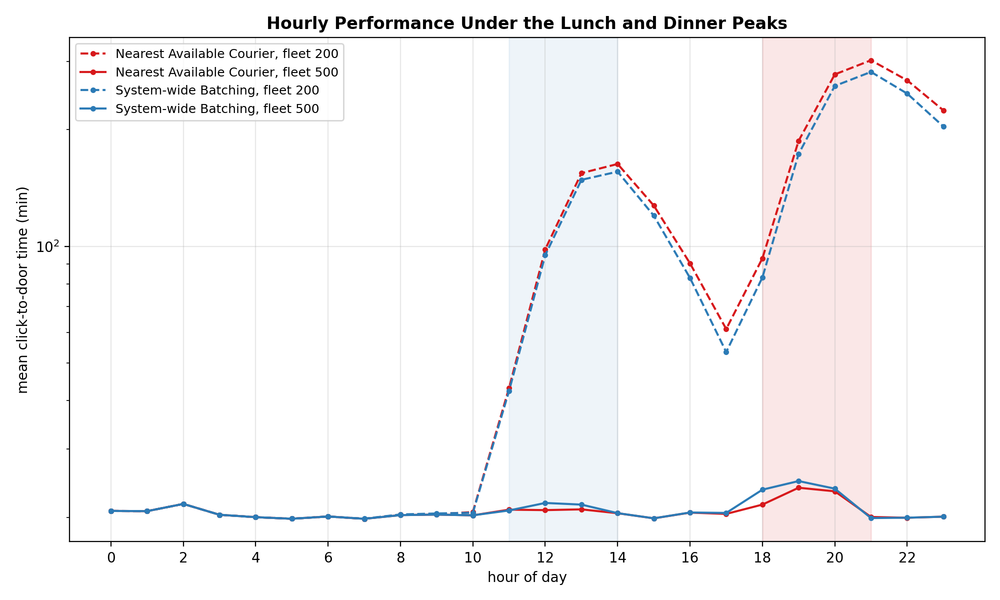

# Introduction

Food delivery is now a routine part of urban life, but the logistics behind it are largely invisible to the customer. Two forces shape how long an order takes. The first is the assignment policy, meaning how the platform decides which courier serves which order. The second is the road network itself, which fixes how fast anyone can move between a restaurant and a door regardless of policy. Most research effort has gone into the first force. Less work treats the network as the binding constraint, and less still examines how the two interact in a specific city.

This paper studies both forces for Washington, DC. The structural questions ask where the network breaks. We ask whether simple metrics find the choke points or whether a path based measure is needed (RQ1), which roads would give the most improvement if upgraded (RQ3), whether restaurant clustering helps or hurts delivery (RQ4), and how much worse a targeted road closure is than a random one (RQ7). The operational questions ask who delivers and how. We ask whether the network has an order volume it cannot move fast enough to meet (RQ2), which assignment method gives the fastest average delivery time (RQ5), how performance shifts during the lunch and dinner rushes (RQ6), and what the ideal number of couriers is (RQ8).

The empirical strategy is deliberately simple. We assemble an evidence base from open data, answer the structural questions with robust network statistics and small counterfactual experiments, and answer the operational questions with a discrete event simulation built on precomputed shortest path matrices. Where a simplification matters we flag it rather than model around it.

# Literature Review

The meal delivery routing problem was formalized by @reyes2018, who showed that the ratio of order volume to available couriers is the primary driver of service quality, a finding our fleet sweep reproduces at city scale. @joshi2022 proved the assignment problem computationally hard and made it tractable by batching orders and solving repeated matchings on the road network, which is the design our batched strategy follows. @giraldo2024 confirmed on Colombian operational data that courier availability, demand, and location interact rather than act separately, which motivates evaluating strategies across fleet sizes rather than at a single operating point.

Two recent papers extend the assignment side. @liang2024 showed that efficient order pooling can be learned from the behavior of skilled couriers, with timing and location mattering most during peak hours, and @cheng2025 showed that dispatching and idle fleet steering are best treated as one system level problem, since good performance requires keeping courier supply balanced with demand across the whole city. On the structural side, @leonardi2023 used a natural experiment in Milan to show that restaurants agglomerate deliberately because proximity to other restaurants raises business. Their result predicts the strong spatial clustering we measure in DC and motivates asking what that clustering does to delivery performance.

# Methodology

## Data and network construction

The drivable street network for the District of Columbia was ingested from OpenStreetMap with OSMnx. Cleaning kept the largest strongly connected component, which preserves 10,027 intersections and 26,938 directed edges (1,928 km of streets) and guarantees that every location can legally reach every other. About a third of edges carry an explicit speed tag, so missing speeds were imputed from the mean tagged speed of the same highway type and every edge received a free flow travel time weight. Restaurant POIs (2,043 after deduplication) were snapped to the network with a median snap distance of 19.4 m. As an external check, 98.3 percent of the 877 active ABCA restaurant class liquor licenses fall within 100 m of an OSM POI, which suggests the POI layer is not missing much of the sit down market. Observed 2024 average annual daily traffic from DDOT attaches to 6,109 edges, the arterial skeleton the city actually monitors.

## Demand proxy and order generation

No public delivery logs exist for DC, so demand is simulated. Census tract population (206 tracts, 672,079 residents) joins to every network node, and dropoff probabilities are proportional to node level population density. A synthetic day of 15,188 orders arrives as a nonhomogeneous Poisson process with lunch and dinner peak multipliers of 3.5 and 4.5, producing 31.7 percent of orders in the lunch window and 41.8 percent in the dinner window with a peak hour of 2,279 orders at 19:00. Pickups draw uniformly from the restaurant POIs. Each order carries its unassisted shortest path drive time, with mean 8.26 minutes, which is the floor no assignment policy can beat.

## Structural measures and experiments

Bottlenecks are measured with travel time weighted edge betweenness centrality approximated over 350 sampled sources, compared against observed AADT and edge speed as simple alternatives. Renovation and closure effects are measured with small counterfactuals on a common origin destination sample of 320 restaurant to demand pairs, upgrading or removing the ten highest betweenness edges and comparing against random controls.

## Discrete event simulation

The operational questions use a discrete event simulation over the synthetic day, with all pairs shortest path travel time matrices precomputed in memory so that every routing query is an array lookup. Orders become ready ten minutes after placement following the ready time treatment of @reyes2018, and dropoffs take two minutes. Two assignment strategies share one commitment rule and differ only in scope. Nearest Available Courier dispatches each order at arrival to the courier who can reach the restaurant soonest. System-wide Batching accumulates orders for 120 second windows and solves an exact minimum cost matching between the full fleet and waiting orders, in the spirit of @joshi2022 and @liang2024. Fleet sizes from 100 to 800 couriers were swept in parallel. Couriers do not reposition while idle and orders are not bundled, both simplifications that @cheng2025 and @liang2024 respectively show can be relaxed with profit.

# Structural Results

## RQ1: where the network breaks

{#fig-aadt width=85%}

As we can see from the plot above, observed traffic volume concentrates on the freeway spine, the river bridges, and a small set of surface arterials. Volume alone, however, is not structure. Betweenness centrality ranks edges by the share of shortest paths that must cross them, and the two measures agree only partially. The Spearman rank correlation between betweenness and observed AADT is 0.47 on monitored edges, and 0.61 between betweenness and free flow speed, yet the top one percent of edges by AADT and by betweenness overlap by just 13 percent.

{#fig-bottlenecks width=85%}

As we can see from the plot above, the betweenness ranking concentrates on a short list of crossings led by the Southeast Freeway and the 3rd Street Tunnel, with New York Avenue and the North Capitol corridor close behind. These are the true chokepoints in the sense that shortest paths have no good way around them. The answer to RQ1 is that simple metrics are useful corroboration but would miss most of the structural chokepoints, so the path based measure is needed.

## RQ4: restaurant clustering

DC restaurants cluster far more tightly than chance would produce. The mean nearest neighbor spacing is 47 m against an expected 147 m under complete spatial randomness, a Clark-Evans ratio of 0.32, consistent with the deliberate agglomeration documented in Milan by @leonardi2023. The delivery relevant question is what clustering does to access. Restaurants inside clusters reach a common population weighted demand sample in 8.29 minutes on average against 9.88 minutes for isolated restaurants, an advantage of about 16 percent.

{#fig-reach width=85%}

As we can see from the plot above, the clusters sit precisely where network reach is best, with most of the city within ten free flow minutes of the 14th Street core. On static accessibility, clustering helps delivery rather than hurting it. What this comparison cannot capture is peak congestion inside clusters and the batching economics that @liang2024 show matter most during rushes, so we treat the operational half of RQ4 as open.

## RQ3: renovation targets

{#fig-renovation width=70%}

As we can see from the plot above, upgrading the ten highest betweenness slow surface edges, which land on Florida Avenue NW and New Jersey Avenue NW, improves mean origin destination travel time by about 0.10 percent, while an equal sized random upgrade is indistinguishable from zero. Targeting by betweenness therefore works, but no ten edge fix meaningfully changes citywide delivery times, because the slow portion of a delivery is the residential last leg rather than any single arterial segment. Renovation budgets should follow the betweenness ranking with expectations set at corridor scale.

## RQ7: robustness to closures

{#fig-closure width=70%}

As we can see from the plot above, closing the ten highest betweenness edges raises mean travel time by 1.32 percent while random closures average near 0.03 percent with a maximum of 0.05, a roughly forty to one asymmetry. No origin destination pair became unreachable in any scenario, which reflects the redundancy of the L'Enfant grid. The grid absorbs almost any random insult, but a small set of crossings carries disproportionate load and warrants treatment as critical infrastructure.

# Operational Results

## Demand generation

{#fig-demand width=95%}

As we can see from the plot above, the simulated day has the twin peak profile that the meal delivery literature treats as the defining operational challenge [@reyes2018]. The 15,188 orders concentrate heavily at dinner, and the unassisted drive time baseline of 8.26 minutes per order sets the physical scale against which every strategy result below should be read.

## RQ5 and RQ8: assignment strategy and fleet size

{#fig-sweep width=95%}

As we can see from the plot above, both strategies trace the same capacity curve, collapsing at 100 to 200 couriers and flattening against a physical floor of about 20.5 minutes beyond 500. The smallest fleet meeting a 45 minute p95 standard is 500 under either strategy, which is the practical answer to RQ8, and pushing to 800 buys under a minute while dropping utilization from 36 to 27 percent. The strategy comparison answers RQ5 conditionally. System-wide Batching outperforms greedy dispatch by 5 to 7 percent in mean delivery time under scarcity, for example 129 against 138 minutes at fleet 200, because global matching cuts wasted pickup travel when couriers are the binding resource. At abundance the ranking flips by roughly one dispatch window of latency. Which method is fastest therefore depends on the operating regime, and under the regimes that matter, scarcity and peaks, batching wins.

## RQ6: peak load

{#fig-peak width=95%}

As we can see from the plot above, peak performance is not a scaled version of off peak performance but a queueing regime change. At fleet 200 the lunch rush pushes hourly means past two hours and the dinner rush past six, with each backlog taking hours to drain. At fleet 500 the identical demand passes through with a ripple, a 19:00 mean near 24 minutes against 21 off peak. The dinner peak binds first, so fleet and strategy decisions should be evaluated at 19:00 rather than on daily averages.

## RQ2: the demand ceiling

The ceiling is an instantaneous rate constraint rather than a volume constraint. An uncongested courier completes about 2.9 orders per hour given the 20.5 minute busy cycle, so holding the 2,279 order 19:00 peak without queue growth would require roughly 780 couriers. The 500 courier fleet that satisfies the daily service standard caps out near 1,461 orders per hour and survives the rush only because the peak is brief enough for its transient backlog to drain afterward. Daily volume is comfortably within capacity, since that same fleet could move about 35,000 orders in a flat day. The answer to RQ2 is that the network and fleet jointly impose a ceiling near 1,500 orders per hour at fleet 500, and it binds at dinner.

# Conclusion

The structural and operational findings are two views of one mechanism. The street network funnels shortest paths through a handful of crossings, concentrates restaurants in corridors that happen to sit at the point of best reach, and offers enough grid redundancy that only targeted disruption hurts. Those same properties reappear operationally as a hard physical floor of about 20.5 minutes per delivery, a fleet requirement near 500 couriers for acceptable daily service, and a dinner hour rate ceiling that no assignment cleverness can lift, only more couriers or a faster network. Assignment policy matters exactly where the structure leaves room, under scarcity, where system-wide batching recovers 5 to 7 percent of delivery time that greedy dispatch wastes.

Three limitations qualify these results. Travel times are free flow values built largely from imputed speeds, so congestion, which would deepen the peaks and sharpen the bottlenecks, is absent. Demand is a population density proxy rather than observed orders. And the simulation excludes order bundling and idle repositioning, both of which the literature shows would improve the batching strategy further [@liang2024, @cheng2025]. Each limitation points the same direction, toward time varying travel times and richer courier behavior on the substrate assembled here, which we leave as the natural next stage of this work.
